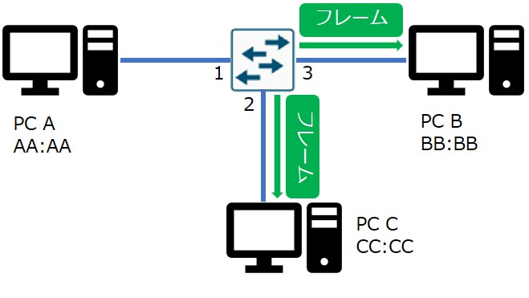
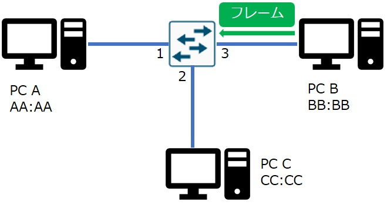
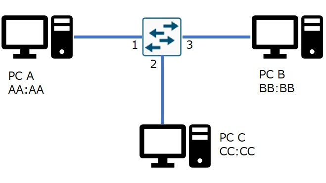
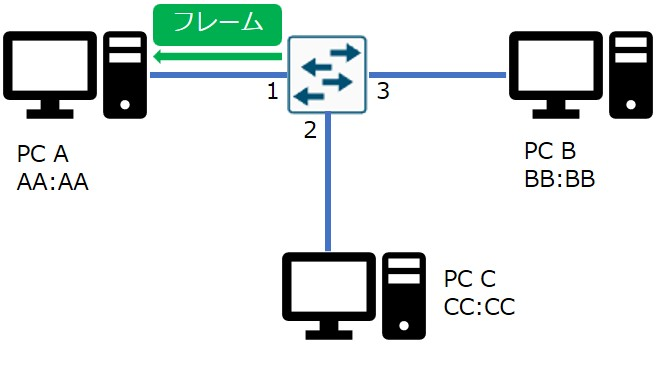
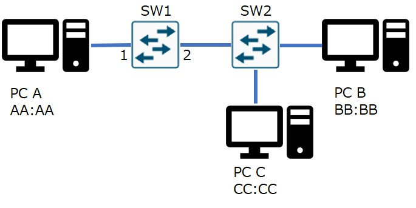

## イーサネット

イーサネットとは、PCやNW機器を接続する媒体(LANケーブルや光ケーブル)とフレーム形式の規格です。
主に有線LANに用いられます。※無線LANではWi-Fiという別の規格が用いられます。

| 規格名 | 通信速度 | ケーブル種類 | 最大ケーブル長 | 備考 |
|-------|---------|------------|--------------|-----|
| 1000BASE-T | 1Gbps | UTP（Cat5e以上）| 100m | LANケーブル |
| 10GBASE-T | 10Gbps | UTP（Cat6a以上）| 100m | 10G対応のLANケーブル |
| 1000BASE-SX | 1Gbps | 62.5/50μm マルチモードファイバ | 275m(62.5), 550m(50)| 短距離用光ケーブル |
| 1000BASE-LX | 1Gbps | 9μm シングルモードファイバ | 5-10km | 長距離用光ケーブル

UTP：シールドなしツイストペア

62.5μmなど：光ファイバーのコアの直径

UTPケーブルにはカテゴリーがあります。

| カテゴリー | 最大伝送速度  | 最大伝送帯域幅 | 備考 |  
|------------|----------------------|---------|---------------|
| Cat1       | アナログ音声信号       | -        | 電話回線用
| Cat3       | 10Mbps              | 16 MHz  | 化石 
| Cat5       | 100Mbps             | 100 MHz | 化石
| Cat5e      | 1Gbps               | 100 MHz | 主流
| Cat6       | 1Gbps（50mまで10Gbps） | 250 MHz | 主流
| Cat6a      | 10Gbps              | 500 MHz | 主流
| Cat7       | 10Gbps              | 600 MHz | アース処理が必須
| Cat8       | 40Gbps          | 2000 MHz | データセンター用途（最大30m）

## イーサネットフレームの構造

イーサネットでデータを送るときは、フレームという形式で送ります。
最も一般的なフレームのタイプは、イーサネットⅡフレームです。

|  | プリアンブル | 宛先MACアドレス | 送信元MACアドレス | タイプ | ペイロード | FCS |
| ------------------| ----------- | ------------- | --------------- | ----- | -------- | --- |
| フィールド長 (byte) | 8 | 6 | 6 | 2 | 46-1500 | 4 |

プリアンブル：フレームの始まりを合図する8byteの固定値フィールド

```
10101010 10101010 10101010 10101010 10101010 10101010 10101010 10101011
```

宛先MACアドレス：宛先のNICのMACアドレスまたはマルチキャストアドレス、ブロードキャストアドレスが入る。

送信元MACアドレス：送信元のNICのMACアドレスが入る。

タイプ：ペイロードにカプセル化されたプロトコルを識別するための**Ether-Type**と呼ばれる値が入る。

| EtherType | プロトコル |
 |--------|------| 
 | 0x0800 | IPv4 |
 | 0x0806 | ARP |
 | 0x86DD | IPv6 |

ペイロード：上位層プロトコルのヘッダとデータ

```
| L3ヘッダ | L4ヘッダ | L7ヘッダ | データ |
```

FCS：フレームに破損がないことを確認するための値が入る。フレームチェックシーケンスの略。

## ユニキャスト、ブロードキャスト、マルチキャスト

ネットワーク通信には、主に3つの種類があります。

ユニキャスト：1つの送信元から1つの特定の宛先へフレームが送信される通信。1対1

ブロードキャスト：1つの送信先から、すべてのホストにフレームが送信される通信。1対すべて

マルチキャスト：複数のホストで構成されたグループのメンバーにフレームが送信される。1対グループ

## MACアドレス

MACアドレスは、NICのチップに書き込まれている一意のアドレスです。NICの工場出荷時に設定されます。物理アドレスと呼ばれることもあります。データリンク層では、このMACアドレスに基づいてフレームを転送します。

MACアドレスは、48bitの値で12桁の16進数で表記します。書き方はいろいろあります。

- 00:00:5E:00:53:AA
- 00-00-5E-00-53-AA
- 0000.5e00.53aa

など

先頭の24bitは、OUIと呼ばれるネットワーク機器の製造ベンダーを識別する世界共通の番号です。

ブロードキャストMACアドレスは「FF:FF:FF:FF:FF:FF」です。

マルチキャストMACアドレスは、先頭の25bitは「01:00:5E」固定で、あとの23bitはマルチキャストグループIPアドレスから計算される値です。

## フレームスイッチング

フレームスイッチングは、ネットワーク機器であるスイッチがデータリンク層（L2）でフレーム単位の転送を行う仕組みのことです。スイッチは、MACアドレステーブルと呼ばれる「MACアドレス」と、「そのMACアドレスに転送する際に使用するポート」の対応表を参照しフレームを転送します。このMACアドレステーブルは、CAMという高速に検索できる特殊なメモリに格納されています。そのため、スイッチのMACアドレステーブルをCAMテーブルと呼ぶこともあります。

フレームスイッチングの動作

|  | アクション |
|---------|-----------|
| 1 | スイッチのポート1でPC Aからのフレームを受信します。 |
| 2 | スイッチは、（PC Aの）送信元MACアドレスと、フレームを受信したポートをテーブルに記録します。 |
| 3 | スイッチは、テーブルに宛先MACアドレスがあるか確認します。未知のアドレスだったので、フレームを受信したポート以外のすべてのポートにフレームをフラッディングします。この例では、PC BとPC Cの両方がフレームを受信します。 |
| 4 | 宛先MACアドレスと一致するMACアドレスを持つデバイス（PC B）が応答し、フレームをPC A宛に送信します。宛先MACアドレスと一致しないMACアドレスを持つデバイス（PC C）はフレームを破棄します。 |
| 5 | スイッチは（PC Bの）送信元MACアドレスと、フレームを受信したポート番号をテーブルに記録します。 |
| 6 | 宛先MACアドレスのポートがテーブルに登録されているので、フラッディングを行うことなく、ポート1のみにフレームを送信します。 |

### ステップ1

スイッチのポート1でPC Aからのフレームを受信します。

| MACアドレス | ポート |
|---------|-----------|
| - | - |


### ステップ2

スイッチは、（PC Aの）送信元MACアドレスと、フレームを受信したポートをテーブルに記録します。

| MACアドレス | ポート |
|---------|-----------|
| AA:AA | 1 |


### ステップ3

スイッチは、テーブルに宛先MACアドレスがあるか確認します。未知のアドレスだったので、フラッディング（フレームを受信したポート以外のすべてのポートにフレームを送信）します。この例では、PC BとPC Cの両方がフレームを受信します。

| MACアドレス | ポート |
|---------|-----------|
| AA:AA | 1 |



### ステップ4

宛先MACアドレスと一致するMACアドレスを持つデバイス（PC B）が応答し、フレームをPC A宛に送信します。宛先MACアドレスと一致しないMACアドレスを持つデバイス（PC C）はフレームを破棄します。

| MACアドレス | ポート |
|---------|-----------|
| AA:AA | 1 |



### ステップ5

スイッチは（PC Bの）送信元MACアドレスと、フレームを受信したポート番号をテーブルに記録します。

| MACアドレス | ポート |
|---------|-----------|
| AA:AA | 1 |
| BB:BB | 3 |



### ステップ6

宛先MACアドレスのポートがテーブルに登録されているので、スイッチは、ポート1のみにフレームを送信します。

| MACアドレス | ポート |
|---------|-----------|
| AA:AA | 1 |
| BB:BB | 3 |



### MACアドレスエントリの保存期間

MACアドレスエントリとは、MACアドレステーブルの1行のことです。
スイッチは、MACアドレステーブルにエントリを追加した際に、このエントリに対してデフォルトで300秒のエージングタイマーを開始します。エージングタイマーが時間切れになると、そのエントリはMACアドレステーブルから削除されます。

## フレームスイッチングに関するよくある勘違い

フレームスイッチングはシンプルな仕組みですが、いくつか誤解されやすいポイントがあります。

### スイッチは宛先MACアドレスで学習する

間違いです。スイッチが学習するのは送信元MACアドレスです。つまり、フレームを送ったきた方のMACアドレスを記録します。宛先MACアドレスは、テーブルから探すだけです。

### 未知の宛先フレームは破棄される

間違いです。未知の宛先フレームはフラッディングされます。

### フレームスイッチングは、IPアドレスも影響する

間違いです。フレームスイッチングにおいては、L2ヘッダ（MACアドレス）だけを使用し、IPアドレスやポート番号は全く関係ありません。※ただし、L3スイッチのACL、QoSなどの機能ではIPアドレスなどを参照することがあります。

### ポートとMACアドレスは常に1対1で対応する

間違いです。実際には、1つのポートに対して複数のMACアドレスが登録されることもあります。この例では、スイッチ1のポート2に、PC BとPC Cの2つMACアドレスが登録されます。

| MACアドレス | ポート |
|---------|-----------|
| AA:AA | 1 |
| BB:BB | 2 |
| CC:CC | 2 |



### スイッチは複雑で難しい

間違いです。スイッチの基本機能は、宛先MACアドレスとMACアドレステーブルに従ってフレームを転送する。ただそれだけです。

## おわり

以上、イーサネットとフレームスイッチングの基本でした!